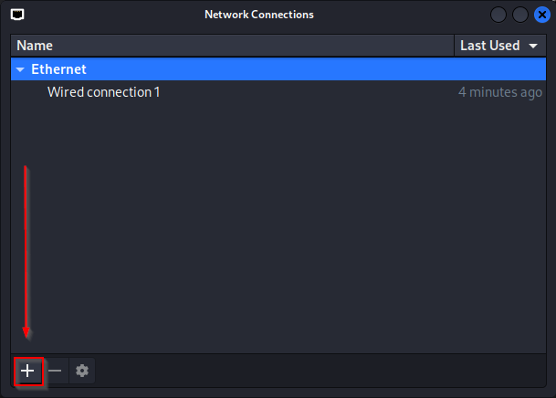
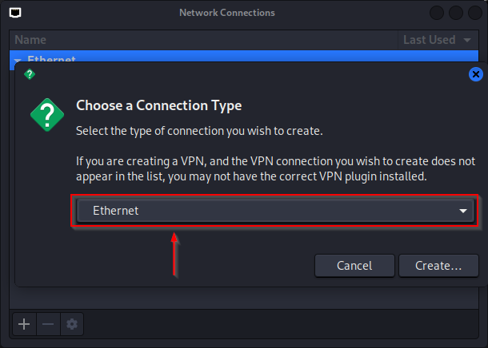
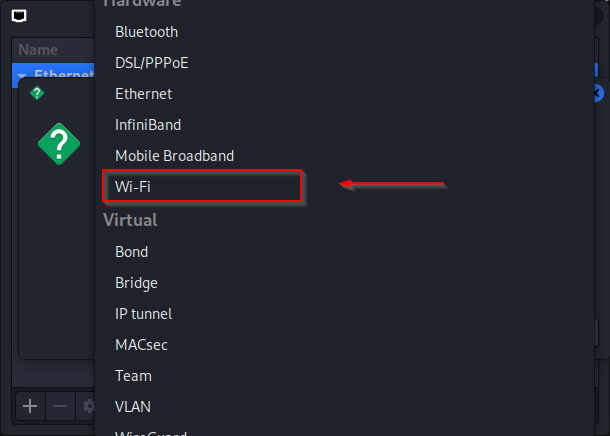

# Installation steps
## Setup Micro-SD-Card
### 1 Click

### 2 Click

### 3 Click and scroll down

### 4 Click

### 5. Click

### 6. Click

### 7. Click

### 8. Click (BE CAREFULLY)

### 9. Click

### 10. Click

### 11. Click


---

## Connect the Pi to the internet
Login to your pi:
- Username: kali 
- Password: kali

### WIFI
use the HDMI port and GUI to connect the pi to wifi via kali-linux

### LAN
use the USB-Data Port to connect a LAN-Cable to the pi

---

## Connect to your Pi

### SSH into your pi
use Windows cmd or powershell to ssh into your pi. Look in your router witch ip your pi has.

```bash
ssh kali@x.x.x.x
```
replace "x.x.x.x" with the IP of your Raspberry pi

---

## Clone Git Repo:
```bash
sudo apt-get install -y git
cd ~
# clone Repository
git clone https://github.com/maodisa/pwnServer.git
cd pwnServer/
sudo chmod +x start_server.sh
```

## Run installation.sh

```bash
sudo chmod +x install.sh
sudo ./install.sh
```

After the installations script is done:

1. Run the crontab -e command
```bash
crontab -e
```
2. Choose "nano" as texteditor (press "1" and hit ENTER)
3. Add the following line to the ent of the file:
```text
@reboot /usr/bin/pwnPal_usb # libcomposite configuration
```
4. Save and close the file. Use the following Commands
```text
STRG+x
SHIFT+y
ENTER
```

Now job will run at the Linux boot time.


---

## Setup Wifi Service - NOT READY
https://www.cloudzilla.ai/dev-education/setting-up-hotspot-on-kali-linux/#get-started

https://www.youtube.com/watch?v=5sWZ2rHCSsQ&t=284s

### new - hostapd
```bash
############################### HOSTAPD ###############################
sudo apt-get install hostapd
sudo service hostapd stop

sudo nano /etc/hostapd/hostapd.conf
```
```text
# Set interface
interface=wlan0
# Set driver to
driver=nl80211
# Set your desired ssid(Wi-Fi name)
ssid=SecretPiNetwork
# Set the access point hardware mode to 802.11g
hw_mode=g
# Select WIFI channel
channel=6
country_code=DE
# Ensure to enable only WPA2
auth_algs=1
wpa=2
wpa_passphrase=password123
wpa_key_mgmt=WPA-PSK
wpa_pairwise=TKIP
rsn_pairwise=CCMP
ignore_broadcast_ssid=0
```
```bash
sudo nano /etc/default/hostapd
```

```text
DAEMON_CONF="/etc/hostapd/hostapd.conf"
```

```bash
sudo systemctl unmask hostapd
sudo systemctl enable hostapd
```

### new - dnsmasq
```bash
############################### DNSMASQ ###############################
sudo su
#sudo apt update
sudo apt-get update
sudo apt-get install dhcpcd5 dnsmasq -y


sudo mv /etc/dnsmasq.conf /etc/dnsmasq.backup
sudo nano /etc/dnsmasq.conf
```
Add Text:
```text
interface=wlan0
except-interface=eth0
dhcp-range=192.168.10.50,192.168.10.150,255.255.255.0,24h
```
```bash
sudo nano /etc/dhcpcd.conf
#interface wlan0
#static ip_address=192.168.10.1/24
#nohook wpa_supplicant
```

### new - dnsmasq & hostapd

```bash
sudo update-rc.d hostapd enable
sudo update-rc.d dnsmasq enable

sudo restart
```
### Debugging
```bash
sudo ip link set wlan0 up

sudo hostapd /etc/hostapd/hostapd.conf

sudo nano /etc/network/interfaces
# Add:
#allow-hotplug wlan0
#iface wlan0 inet static
#    address 192.168.10.1
#    netmask 255.255.255.0

sudo ifdown wlan0 && sudo ifup wlan0
sudo systemctl restart dnsmasq
sudo systemctl status dnsmasq

```

## OLD
```bash
apt-get install hostapd
apt-get install dnsmaq
sudo service hostapd stop
sudo service dnsmasq stop
sudo update-rc.d hostapd disable
sudo update-rc.d dnsmasq disable

echo '# Only bind it to one interface
bind-interfaces
# Select the interface to use for binding
interface=wlan0
# Select a scope of IP addresses to be used in DHCP leasing
dhcp-range=192.168.1.1,192.168.1.9' | tee -a /etc/dnsmasq.conf

echo '# Set interface
interface=wlan0
# Set driver to
driver=nl80211
# Set your desired ssid(Wi-Fi name)
ssid=SecretPiNetwork
# Set the access point hardware mode to 802.11g
hw_mode=g
# Select WIFI channel
 channel=6
# Ensure to enable only WPA2
wpa=2
wpa_passphrase="password123"
wpa_key_mgmt=WPA-PSK
wpa_pairwise=TKIP
rsn_pairwise=CCMP' | tee -a /etc/hostapd.conf

sudo systemctl unmask dnsmasq
sudo systemctl unmask hostapd

sudo systemctl enable dnsmasq
sudo systemctl enable hostapd

sudo service dnsmasq stop
sudo service hostapd stop

sudo service dnsmasq start
sudo service hostapd start
```

### 1. Search for "Advanced Network Settings"

### 2. Click

### 3. Click

### 4. Click


### 5. HIER WEITER MACHEN!!!


---

## (OPTIONAL) battery - pisugar2
```bash
sudo su
raspi-config # --> i2f aktivieren

exit

wget https://cdn.pisugar.com/release/pisugar-power-manager.sh
bash pisugar-power-manager.sh -c release
nano /etc/pisugar-server/config.json
```

change the text

```text
"auto_power_on": true,
```

or use the webinterface at "127.0.0.1::8421"

```bash
sudo reboot
```

### Commands of controlling pisugar-server systemd service
```bash
# reload daemon
sudo systemctl daemon-reload

# check status
sudo systemctl status pisugar-server

# start service
sudo systemctl start pisugar-server

# stop service
sudo systemctl stop pisugar-server

# disable service
sudo systemctl disable pisugar-server

# enable service
sudo systemctl enable pisugar-server
```

---

## (OPTIONAL) remove xfce (remove desktop env):
to reduce cpu usage
```bash
sudo apt purge xfce4* lightdm*
```
