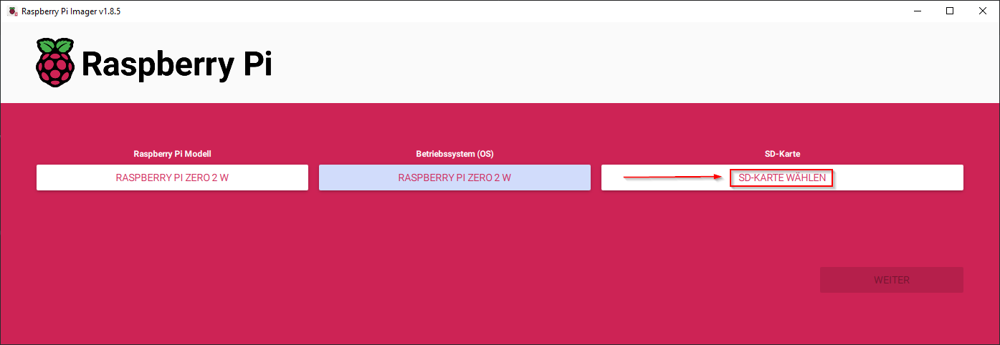

# Installation steps

## Setup Micro-SD-Card

### 1 Click


### 2 Click


### 3 Click and scroll down


### 4 Click


### 5. Click


### 6. Click


### 7. Click



### 8. Click (BE CAREFULLY)


### 9. Click


### 10. Click


### 11. Click


---

## Connect the Pi to the internet

Login to your pi:

- Username: kali
- Password: kali

[//]: # (### WIFI)

[//]: # (use the HDMI port and GUI to connect the pi to wifi via kali-linux)

### use LAN !!!

use the USB-Data Port to connect a LAN-Cable to the pi

---

## Connect to your Pi

### SSH into your pi

use Windows cmd or powershell to ssh into your pi. Look in your router witch ip your pi has.

```bash
ssh kali@x.x.x.x
```

replace "x.x.x.x" with the IP of the Raspberry pi in your Network

---

## Setup AccessPoint Service

### hostapd

```bash
############################### HOSTAPD ###############################
sudo apt update
sudo apt-get update
sudo apt-get install -y hostapd
sudo service hostapd stop
sudo update-rc.d hostapd disable


sudo nano /etc/hostapd/hostapd.conf
```

```text
# Set interface
interface=wlan0
# Set driver to
driver=nl80211
# Set your desired ssid(Wi-Fi name)
ssid=MyPiNetwork4
# Set the access point hardware mode to 802.11g
hw_mode=g
# Select WIFI channel
channel=6
country_code=DE
# Ensure to enable only WPA2
auth_algs=1
wpa=2
wpa_passphrase=Start12345
wpa_key_mgmt=WPA-PSK
wpa_pairwise=TKIP
rsn_pairwise=CCMP
ignore_broadcast_ssid=0
```

```bash
sudo nano /etc/default/hostapd
```

```text
DAEMON_CONF="/etc/hostapd/hostapd.conf"
```

### dnsmasq

```bash
############################### DNSMASQ ###############################
sudo su
#sudo apt update
sudo apt-get update
sudo apt-get install -y dhcpcd5 dnsmasq
sudo service dnsmasq stop
sudo update-rc.d dnsmasq disable


sudo mv /etc/dnsmasq.conf /etc/dnsmasq.backup
sudo nano /etc/dnsmasq.conf
```

Add Text:

```text
interface=wlan0
except-interface=eth0
dhcp-range=192.168.10.50,192.168.10.150,255.255.255.0,24h
```

```bash
sudo nano /etc/dhcpcd.conf
```

Add Text:

```text
interface wlan0
static ip_address=192.168.10.1/24
nohook wpa_supplicant
```

```bash
sudo nano /etc/network/interfaces
```

Add Text:

```text
allow-hotplug wlan0
iface wlan0 inet static
    address 192.168.10.1
    netmask 255.255.255.0
```

```bash
sudo ip link set wlan0 up
sudo ifdown wlan0 && sudo ifup wlan0
sudo ip link set wlan0 up
```

```bash
sudo systemctl unmask hostapd
sudo systemctl enable hostapd
sudo update-rc.d hostapd enable
sudo update-rc.d dnsmasq enable
```

Set the WIFI-Country right

```bash
sudo raspi-config
```

1. "04 Localisation Options"
2. "I4 Change Wi-fi Country"
3. Set to "DE" - Germany
4. Reboot the pi if asked - if not, rebot the pi manually

After Reboot - Check if Services are running

```bash
sudo service --status-all
```

1. hostapd
2. dnsmasq

---


## Setup BadUSB:

```bash
sudo su
sudo apt update
sudo apt-get update
#sudo apt upgrade
#sudo apt-get upgrade

#sudo apt --fix-broken install

sudo apt-get install -y git
cd ~
# clone Repository
git clone https://github.com/maodisa/pwnServer.git
cd pwnServer/

##### OPTIONAL FOR DEVELOPMENT!!!!
git checkout terminal
#####

sudo chmod +x start_server.sh
```

## Run installation.sh

[//]: # (```bash)

[//]: # (sudo chmod +x install.sh)

[//]: # (sudo ./install.sh)

[//]: # (```)

install.sh:

```bash
# update the pi
#sudo apt-get update
#sudo apt dist-upgrade -y

# install needed packages
sudo apt-get install -y python3 python3-pip python3.12-venv

# create .venv dir
python3 -m venv .venv

# activate venv
# Jedes Mal, wenn du die Anwendung startest, musst du die virtuelle Umgebung aktivieren
#sudo su
source .venv/bin/activate

# install pip requirements
pip3 install -r setup/requirements.txt

# search for usb-port
lsusb
# $ Bus 001 Device 002: ID <Vendor-ID>:<Product-ID> [Beschreibung]

# create File "99-badusb.rules" and write to it
echo 'SUBSYSTEM=="usb", ATTR{idVendor}=="1d6b", ATTR{idProduct}=="0002", RUN+="/usr/bin/python3 ~/pwnServer/app/admin/python/ducky_script/hid_trigger.py"' | sudo tee -a /etc/udev/rules.d/99-badusb.rules

# change to executable
# git checkout terminal
sudo chmod +x /home/kali/pwnServer/app/admin/python/ducky_script/hid_trigger.py

# setup pi config to set pi as usb
echo "dtoverlay=dwc2" | sudo tee -a /boot/config.txt
echo "dwc2" | sudo tee -a /etc/modules
echo "libcomposite" | sudo tee -a /etc/modules

sudo su

# create File "pwnPal_usb" and write to it
echo '#!/bin/bash
cd /sys/kernel/config/usb_gadget/
mkdir -p pwnServer
cd pwnServer
echo 0x1d6b > idVendor # Linux Foundation
echo 0x0104 > idProduct # Multifunction Composite Gadget
echo 0x0100 > bcdDevice # v1.0.0
echo 0x0200 > bcdUSB # USB2
mkdir -p strings/0x409
echo "fedcba0123456789" > strings/0x409/serialnumber
echo "Pwn Community" > strings/0x409/manufacturer
echo "Good USB Device" > strings/0x409/product
mkdir -p configs/c.1/strings/0x409
echo "Config 1: ECM network" > configs/c.1/strings/0x409/configuration
echo 250 > configs/c.1/MaxPower

# Add functions here
# https://www.isticktoit.net/?p=1383
# HID!!
#mkdir -p functions/hid.usb0
#echo 1 > functions/hid.usb0/protocol
#echo 1 > functions/hid.usb0/subclass
#echo 8 > functions/hid.usb0/report_length
#echo -ne \\x05\\x01\\x09\\x06\\xa1\\x01\\x05\\x07\\x19\\xe0\\x29\\xe7\\x15\\x00\\x25\\x01\\x75\\x01\\x95\\x08\\x81\\x02 > ln -s functions/hid.usb0 configs/c.1/
#
## MOUSE!!
#mkdir -p functions/hid.mouse
#echo 0 > functions/hid.mouse/protocol
#echo 0 > functions/hid.mouse/subclass
#echo 7 > functions/hid.mouse/report_length
#echo -ne \\x05\\x01\\x09\\x02\\xa1\\x01\\x09\\x01\\xa1\\x00\\x05\\x09\\x19\\x01\\x29\\x03\\x15\\x00\\x25\\x01\\x95\\x03>ln -s functions/hid.mouse configs/c.1/
#
## USB!!
#FILE=/piusb.bin
#MNTPOINT=/mnt/usb_share
#mkdir -p ${MNTPOINT}
## mount -o loop,ro,offset=1048576 -t ext4 $FILE ${FILE/img/d} # FOR OLD WAY OF MAKING THE IMAGE
#mount -o loop,ro, -t vfat $FILE ${MNTPOINT} # FOR IMAGE CREATED WITH DD
#mkdir -p functions/mass_storage.usb0
#echo 1 > functions/mass_storage.usb0/stall
#echo 0 > functions/mass_storage.usb0/lun.0/cdrom
#echo 0 > functions/mass_storage.usb0/lun.0/ro
#echo 0 > functions/mass_storage.usb0/lun.0/nofua
#echo $FILE > functions/mass_storage.usb0/lun.0/file
#ln -s functions/mass_storage.usb0 configs/c.1/

# End functions

ls /sys/class/udc > UDC' | sudo tee -a /usr/bin/pwnPal_usb

sudo chmod +x /usr/bin/pwnPal_usb
```

After the installations script is done:

1. Run the crontab -e command

```bash
crontab -e
```

2. Choose "nano" as texteditor (press "1" and hit ENTER)
3. Add the following line to the ent of the file:

```text
@reboot /usr/bin/pwnPal_usb # libcomposite configuration
```

4. Save and close the file. Use the following Commands

```text
STRG+x
SHIFT+y
ENTER
```
```bash
sudo reboot
```

Now job will run at the Linux boot time.

---


## (OPTIONAL) battery - pisugar2

```bash
sudo su
raspi-config # --> i2f aktivieren

exit

wget https://cdn.pisugar.com/release/pisugar-power-manager.sh
bash pisugar-power-manager.sh -c release
nano /etc/pisugar-server/config.json
```

change the text

```text
"auto_power_on": true,
```

or use the webinterface at "127.0.0.1::8421"

```bash
sudo reboot
```

### Commands of controlling pisugar-server systemd service

```bash
# reload daemon
sudo systemctl daemon-reload

# check status
sudo systemctl status pisugar-server

# start service
sudo systemctl start pisugar-server

# stop service
sudo systemctl stop pisugar-server

# disable service
sudo systemctl disable pisugar-server

# enable service
sudo systemctl enable pisugar-server
```

---

## (OPTIONAL) remove xfce (remove desktop env):

to reduce cpu usage

```bash
sudo apt purge xfce4* lightdm*
```
