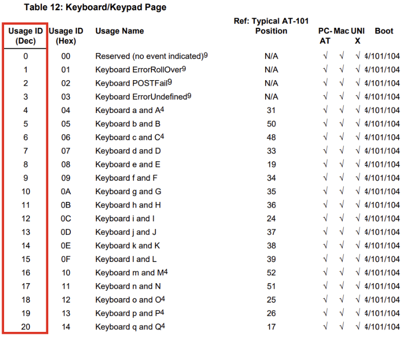

# PwnServer Guide

## Overview
Das PwnServer-Projekt verwandelt einen Raspberry Pi Zero 2 W in einen BadUSB, der als USB-Tastatur erkannt wird und gleichzeitig ein Webinterface bietet, um Ducky Script Payloads über ein erstelltes WLAN-Netzwerk auszuführen.

Mit diesem Projekt kannst du Payloads in Ducky Script hochladen, speichern, suchen und direkt über das Webinterface auf dem verbundenen Zielgerät ausführen.

---

## Funktionen
- Startet ein WLAN-Netzwerk (Hotspot)
- Webinterface für die Steuerung von Ducky Script Payloads
- Ausführen und Speichern von Payloads
- USB-HID Unterstützung (als Tastatur erkannt)

---

## Projektstruktur
- `pwn_server.py`: Hauptserver, der das Webinterface bereitstellt und Payloads injiziert.
- `config.yaml`: Konfigurationsdatei für SSID, Passwort und WebUI Zugangsdaten.
- `run_payload.sh`: Bash-Skript zur Ausführung der Ducky Script Payloads.
- `templates/index.html`: Webinterface für die Steuerung des PwnServers.
- `payloads/`: Verzeichnis für gespeicherte Ducky Script Payloads.

---

## Requirements
1. **Hardware**
   - Raspberry Pi Zero 2 W
   - USB-Verbindung zu einem Rechner, um den Pi als BadUSB zu betreiben
   - WLAN-Adapter (integriert im Raspberry Pi Zero 2 W)
   
2. **Software**
   - **Kali Linux** vorinstalliert auf dem Pi (aktuellste Version)
   - **Python 3** und **pip**
   - **Flask** Webframework
   - **nmcli** für WLAN-Netzwerkmanagement

3. **Ducky Script Interpreter**
   - Wir verwenden das Tool **DuckPi**, um Ducky Script Payloads auf dem Pi auszuführen.

---

## Installation steps
### battery - pisugar2 - OPTIONAL!
```bash
sudo su
raspi-config # --> i2f aktivieren

exit

wget https://cdn.pisugar.com/release/pisugar-power-manager.sh
bash pisugar-power-manager.sh -c release
nano /etc/pisugar-server/config.json
```

change the text

```text
"auto_power_on": true,
```

or use the webinterface

```bash
sudo reboot
```

#### Commands of controlling pisugar-server systemd service
```bash
# reload daemon
sudo systemctl daemon-reload

# check status
sudo systemctl status pisugar-server

# start service
sudo systemctl start pisugar-server

# stop service
sudo systemctl stop pisugar-server

# disable service
sudo systemctl disable pisugar-server

# enable service
sudo systemctl enable pisugar-server
```


---

### remove xfce to reduce cpu usage: 

```bash
sudo apt purge xfce4* lightdm*
```
---


#### install python venv!!! --> oder alles als root?
```bash
sudo apt install python3.12-venv
# im pwnServer ordner:
python3 -m venv .venv

# Jedes Mal, wenn du die Anwendung startest, musst du die virtuelle Umgebung aktivieren
source .venv/bin/activate
```

#### Set-Up autorun for ducky
```bash
lsusb
# $ Bus 001 Device 002: ID <Vendor-ID>:<Product-ID> [Beschreibung]
sudo nano /etc/udev/rules.d/99-badusb.rules
# add lines:
# ANPASSEN AUF ROOT!!!
## SUBSYSTEM=="usb", ATTR{idVendor}=="<Vendor-ID>", ATTR{idProduct}=="<Product-ID>", RUN+="/usr/bin/python3 /home/kali/pwnServer/app/admin/python/ducky_script/hid_trigger.py"

# change to executable
sudo chmod +x /home/kali/pwnServer/app/admin/python/ducky_script/hid_trigger.py

#restart the service:


# Debugging der Udev-Regeln
sudo udevadm monitor --environment --udev

# Überprüfen der Systemprotokolle:
sudo journalctl -f
```


### Pi as HID-Device (Keyboard)
https://randomnerdtutorials.com/raspberry-pi-zero-usb-keyboard-hid/
```bash
sudo apt update
sudo apt dist-upgrade


echo "dtoverlay=dwc2" | sudo tee -a /boot/config.txt
echo "dwc2" | sudo tee -a /etc/modules
sudo echo "libcomposite" | sudo tee -a /etc/modules

# Creating the config script
sudo touch /usr/bin/pwnPal_usb
pi@raspberrypi:~ $ sudo chmod +x /usr/bin/pwnPal_usb # {DeviceName}
```
1. Run the crontab -e command
2. Add the job to the @reboot.
3. Add the following line to the ent of the file:
4. @reboot /usr/bin/pwnPal_usb # libcomposite configuration
5. Save and close the file. 

Now job will run at the Linux boot time.
```bash
sudo nano /usr/bin/pwnPal_usb
```
Add the following:
```bash
#!/bin/bash
cd /sys/kernel/config/usb_gadget/
mkdir -p isticktoit
cd isticktoit
echo 0x1d6b > idVendor # Linux Foundation
echo 0x0104 > idProduct # Multifunction Composite Gadget
echo 0x0100 > bcdDevice # v1.0.0
echo 0x0200 > bcdUSB # USB2
mkdir -p strings/0x409
echo "fedcba0123456789" > strings/0x409/serialnumber
echo "Pwn Community" > strings/0x409/manufacturer
echo "Good USB Device" > strings/0x409/product
mkdir -p configs/c.1/strings/0x409
echo "Config 1: ECM network" > configs/c.1/strings/0x409/configuration
echo 250 > configs/c.1/MaxPower

# Add functions here
# https://www.isticktoit.net/?p=1383
# HID!!
mkdir -p functions/hid.usb0
echo 1 > functions/hid.usb0/protocol
echo 1 > functions/hid.usb0/subclass
echo 8 > functions/hid.usb0/report_length
echo -ne \\x05\\x01\\x09\\x06\\xa1\\x01\\x05\\x07\\x19\\xe0\\x29\\xe7\\x15\\x00\\x25\\x01\\x75\\x01\\x95\\x08\\x81\\x02\\x95\\x01\\x75\\x08\\x81\\x03\\x95\\x05\\x75\\x01\\x05\\x08\\x19\\x01\\x29\\x05\\x91\\x02\\x95\\x01\\x75\\x03\\x91\\x03\\x95\\x06\\x75\\x08\\x15\\x00\\x25\\x65\\x05\\x07\\x19\\x00\\x29\\x65\\x81\\x00\\xc0 > functions/hid.usb0/report_desc
ln -s functions/hid.usb0 configs/c.1/

# MOUSE!!
mkdir -p functions/hid.mouse
echo 0 > functions/hid.mouse/protocol
echo 0 > functions/hid.mouse/subclass
echo 7 > functions/hid.mouse/report_length
echo -ne \\x05\\x01\\x09\\x02\\xa1\\x01\\x09\\x01\\xa1\\x00\\x05\\x09\\x19\\x01\\x29\\x03\\x15\\x00\\x25\\x01\\x95\\x03\\x75\\x01\\x81\\x02\\x95\\x01\\x75\\x05\\x81\\x03\\x05\\x01\\x09\\x30\\x09\\x31\\x15\\x81\\x25\\x7f\\x75\\x08\\x95\\x02\\x81\\x06\\xc0\\xc0 > functions/hid.mouse/report_desc
ln -s functions/hid.mouse configs/c.1/

# USB!!
FILE=/piusb.bin
MNTPOINT=/mnt/usb_share
mkdir -p ${MNTPOINT}
# mount -o loop,ro,offset=1048576 -t ext4 $FILE ${FILE/img/d} # FOR OLD WAY OF MAKING THE IMAGE
mount -o loop,ro, -t vfat $FILE ${MNTPOINT} # FOR IMAGE CREATED WITH DD
mkdir -p functions/mass_storage.usb0
echo 1 > functions/mass_storage.usb0/stall
echo 0 > functions/mass_storage.usb0/lun.0/cdrom
echo 0 > functions/mass_storage.usb0/lun.0/ro
echo 0 > functions/mass_storage.usb0/lun.0/nofua
echo $FILE > functions/mass_storage.usb0/lun.0/file
ln -s functions/mass_storage.usb0 configs/c.1/

# End functions

ls /sys/class/udc > UDC
```

Establish an SSH connection with your Pi and use the next command to create a new Python script:

```bash
nano example.py
```

```python
#!/usr/bin/env python3
NULL_CHAR = chr(0)

def write_report(report):
    with open('/dev/hidg0', 'rb+') as fd:
        fd.write(report.encode())

def execute_duckyscript(file_path):
    with open(file_path, 'r') as f:
        for line in f:
            command = line.strip()
            if command.startswith("DELAY"):
                delay_time = int(command.split()[1])
                time.sleep(delay_time / 1000.0)  # DELAY in ms
            elif command.startswith("PRINT"):
                text = command.split(' ', 1)[1]
                for char in text:
                    write_character(char)
            # Weitere Duckyscript-Befehle können hier hinzugefügt werden

def write_character(char):
    # Hier können die Charaktere für die Eingabe hinzugefügt werden
    if char.isalpha():
        key_code = ord(char.lower()) - ord('a') + 4  # a=4, b=5, ..., z=30
        write_report(NULL_CHAR*2 + chr(key_code) + NULL_CHAR*5)
        write_report(NULL_CHAR*8)  # Release key
    elif char == ' ':
        write_report(NULL_CHAR*2 + chr(44) + NULL_CHAR*5)  # SPACE
        write_report(NULL_CHAR*8)  # Release key
    # Weitere Zeichen können hier behandelt werden

if __name__ == "__main__":
    import time
    execute_duckyscript("duckyscript.txt")
```
# wie verschiedene keyboards hinzufügen und alles dynamischer halten?
Erstelle "duckyscript.txt":
```yaml
DELAY 1000
PRINT Hello
DELAY 500
PRINT World

```


execute Code via:

```bash
sudo python3 example.py
```





### 1. Projekt klonen

Zuerst musst du das Projekt auf den Raspberry Pi klonen:

```bash
git clone https://github.com/maodisa/pwnServer.git
cd pwnServer
```
### 2. Abhängigkeiten installieren
Installiere die notwendigen Python-Pakete:

```bash
sudo apt-get update
sudo apt-get install -y python3 python3-pip git
pip3 install -r requirements.txt
```

### 3. Ducky Script Interpreter (DuckPi) installieren
DuckPi wird verwendet, um Ducky Script in Tastatureingaben umzuwandeln. Klone und installiere DuckPi:

```bash
cd /opt/
git clone https://github.com/JohnSmithTech/duckpi.git
cd duckpi
sudo python3 setup.py install
```

### 4. HID Gadget (BadUSB) konfigurieren
Damit der Raspberry Pi als USB-Tastatur erkannt wird, musst du das HID Gadget konfigurieren. Führe folgendes Skript aus:

```bash
sudo bash -c 'echo -e "options g_hid usbgadget=1 hid=2" > /etc/modprobe.d/g_hid.conf'
```

Starte anschließend den Pi neu:

```bash
sudo reboot
```

### 5. WLAN-Hotspot konfigurieren
Das Projekt verwendet nmcli, um ein WLAN-Netzwerk zu erstellen, sobald der Pi eingeschaltet wird. Das Netzwerk wird über das Flask-Backend gesteuert.

Du kannst die Konfiguration in der Datei config.yaml anpassen:

```yaml
SSID: "PwnPi"
Password: "supersecret"
WebUI_Username: "admin"
WebUI_Password: "password"
```
### 6. Systemd-Service einrichten
Erstelle einen Systemd-Service, damit das PwnServer-Programm automatisch beim Start des Raspberry Pi ausgeführt wird.

Erstelle eine neue Service-Datei:

```bash
sudo nano /etc/systemd/system/pwnserver.service
```
Füge folgenden Inhalt in die Datei ein:

```ini
[Unit]
Description=PwnServer Service
After=network.target

[Service]
ExecStart=/usr/bin/python3 /home/kali/pwnServer/pwn_server.py
WorkingDirectory=/home/kali/pwnServer
StandardOutput=inherit
StandardError=inherit
Restart=always
User=kali

[Install]
WantedBy=multi-user.target
```

Speichere die Datei und starte den Service:

```bash
sudo systemctl enable pwnserver.service
sudo systemctl start pwnserver.service
```
### 7. Projektverzeichnisstruktur
Das Projekt sollte die folgende Verzeichnisstruktur haben:

```graphql

pwnServer/
│
├── config.yaml                   # Konfigurationsdatei für Netzwerk- und Web-UI-Einstellungen
├── pwn_server.py                 # Haupt-Server-Skript (startet Webserver und steuert BadUSB)
├── run_payload.sh                # Bash-Skript, um die Ducky Script Payload auszuführen
├── requirements.txt              # Python-Abhängigkeiten für das Projekt
├── README.md                     # Projektbeschreibung
├── INSTALLATION.md               # Installationsanleitung
├── payloads/                     # Verzeichnis für gespeicherte Ducky Script Payloads
│   └── example_payload.txt        # Beispiel-Payload
├── templates/                    # HTML-Templates für das Webinterface
│   └── index.html                # Haupt-HTML-Seite des Webservers
└── scripts/                      # Verzeichnis für unterstützende Skripte oder Dateien
    └── duckpi/                   # Verzeichnis mit DuckPi (optional, wenn du es lokal ins Projekt einbinden willst)
```

## Nutzung des PwnServer

1. Pi anschließen und Webinterface aufrufen
   - Sobald der Pi über USB mit einem Rechner verbunden ist, startet er automatisch und wird als USB-Tastatur erkannt. Gleichzeitig wird der WLAN-Hotspot aktiviert.
   - Verbinde dich mit dem WLAN des Pi (SSID und Passwort stehen in config.yaml).
   - Öffne einen Browser und gehe zu http://<Pi-IP-Adresse> (normalerweise http://192.168.4.1).
2. Ducky Script Payloads ausführen
   - Du kannst entweder direkt ein Ducky Script Payload im Webinterface eingeben und ausführen oder
   - Du kannst Payloads hochladen und später über eine Suche abrufen und ausführen.
3. Payloads suchen und ausführen
   - Das Webinterface bietet eine Suchfunktion, mit der du nach gespeicherten Payloads suchen und sie schnell ausführen kannst.

### Konfiguration
Anpassung der config.yaml
In der Datei config.yaml kannst du folgende Parameter anpassen:

SSID: Der Name des WLAN-Hotspots, den der Pi erstellt.
Password: Das Passwort für den WLAN-Hotspot.
WebUI_Username: Der Benutzername für den Login ins Webinterface.
WebUI_Password: Das Passwort für das Webinterface.
### Fehlersuche

#### 1. Service-Probleme
Falls der PwnServer nicht automatisch startet, kannst du den Status des Services überprüfen:

```bash
sudo systemctl status pwnserver.service
```
#### 2. USB-HID Probleme
Falls der Pi nicht als USB-Tastatur erkannt wird, überprüfe, ob das HID Gadget korrekt eingerichtet wurde:

```bash
lsmod | grep g_hid
```
## Lizenz
Dieses Projekt steht unter der MIT-Lizenz. Siehe die Datei LICENSE für weitere Details.

```yaml
---

### Erklärungen

- Die Datei ist in Markdown-Format, ideal für Dokumentationen in Git-Repositories.
- Die Anleitung ist in logische Abschnitte unterteilt: Voraussetzungen, Installationsschritte, Nutzung und Fehlersuche.
- Wichtige Befehle und Dateipfade sind klar strukturiert.
- Es gibt Hinweise zur Fehlersuche und zur Anpassung der Konfiguration.
```
Du kannst diese Datei einfach in dein Git-Repository als `INSTALLATION.md` einfügen, um deinen Nutzern eine einfache Installationsanleitung zur Verfügung zu stellen.
